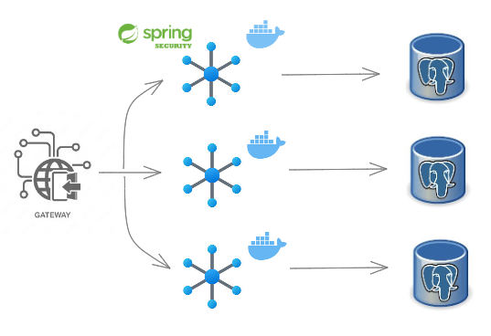
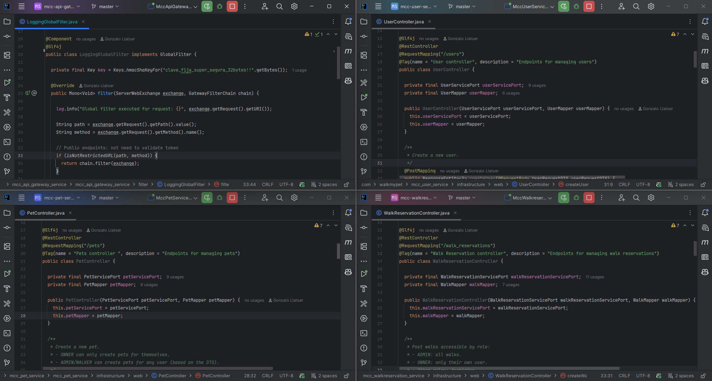

# 🐾 WalkMyPet – Gestión de mascotas y reservas de paseos

Aplicación **backend full-stack** basada en **microservicios**, desarrollada con **Spring Boot**, **PostgreSQL** y **Docker**.
Este proyecto representa una **demostración avanzada de conocimientos en backend y microservicios**, aplicando buenas prácticas como seguridad con **JWT**, roles y permisos, documentación con **OpenAPI/Swagger**, y arquitectura hexagonal.

## 🔹 Arquitectura general

- **API Gateway**: Encaminamiento de requests, validación de JWT y control de roles.
- **Microservicios independientes**:
    - `user-service` – gestión de usuarios y autenticación.
    - `pet-service` – gestión de mascotas.
    - `walk-service` – gestión de reservas de paseos.
- Cada microservicio con **base de datos PostgreSQL propia** en contenedor Docker.
- Documentación de API mediante **OpenAPI/Swagger**.

<p align="left">
  
</p>

## 🔧 Tecnologías utilizadas

### ⚙️ Backend / Microservicios
    
 

### 🔒 Seguridad
 

### 🛠️ Otros
  

## 🧪 Funcionalidades implementadas

- **CRUD completos** en cada microservicio: usuarios, mascotas y reservas de paseos.
- **Seguridad avanzada**: hash de contraseñas, JWT, roles y permisos específicos.
- Validación de permisos a través del **API Gateway**.
- **Población automática de BBDD** con Flyway.
- Pruebas de endpoints con **Postman**.
- Documentación accesible vía **Swagger/OpenAPI**.

<p align="left">
  
</p>

## 🚀 Requisitos y ejecución

### 1️⃣ Backend

1. Tener instalado **Java 17** o superior y **Maven**.
2. Clonar el repositorio y entrar en cada microservicio:

```
cd user-service
cd pet-service
cd walk-service
```

3. Levantar los contenedores de PostgreSQL mediante Docker (cada micro con su BBDD):

```
docker-compose up -d
```
4. Configurar las credenciales en application.yml o application.properties de cada micro según tu entorno.
5. Ejecutar cada microservicio:

```
mvn spring-boot:run
```
6. Acceder a la documentación Swagger de cada micro:

```
http://localhost:8081/v3/api-docs  -> user-service
http://localhost:8082/v3/api-docs  -> pet-service
http://localhost:8083/v3/api-docs  -> walk-service
```

### 2️⃣ API Gateway

1. Configurar application.yml con las URLs de cada micro y las reglas de rutas.

2. Ejecutar el gateway:
```
mvn spring-boot:run
```
## 📸 Microservicios y API Gateway
<p align="center"> 

## 🧪 Cómo probar o contribuir

1. Clonar el repositorio.

2. Seguir los pasos de instalación y ejecución.

¡Listo! Ya puedes probar o contribuir al proyecto.

## 🔮 Futuras mejoras

- Integración con Frontend en Angular/Ionic.

- Tests unitarios e integración.

- Despliegue en AWS/GCP con contenedores Docker.

- Búsqueda avanzada de paseos y mascotas.

- Notificaciones vía email o push a usuarios.

## 🙏 Agradecimientos

Este proyecto fue desarrollado con dedicación y pasión por el aprendizaje.

Quiero agradecer especialmente a:
- **Mis colegas y compañeros de estudio**, por su apoyo, colaboración y motivación constante.
- **Los tutores y formadores de los cursos**, por compartir sus conocimientos, guiarme y brindar recursos que fueron clave durante el desarrollo.

Cada línea de código representa esfuerzo, aprendizaje y superación personal. Gracias por tomarte el tiempo de revisar este proyecto. ¡Espero que te guste y no dudes en dejar tu opinión!